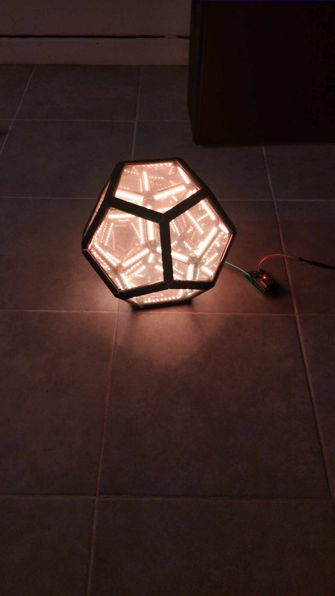
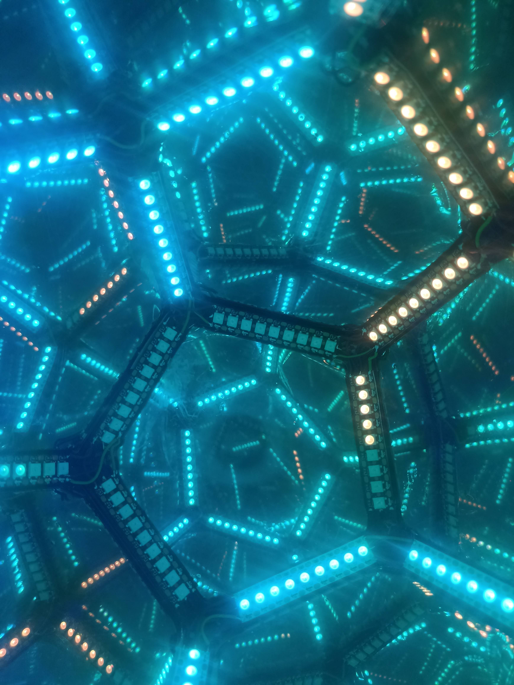
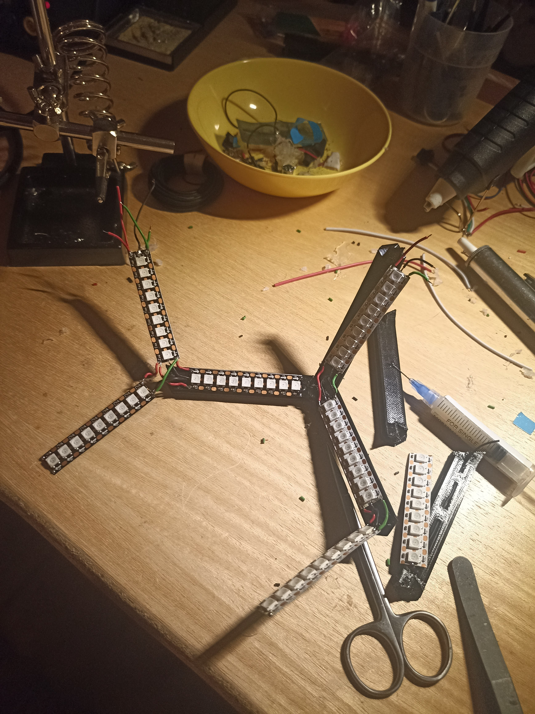
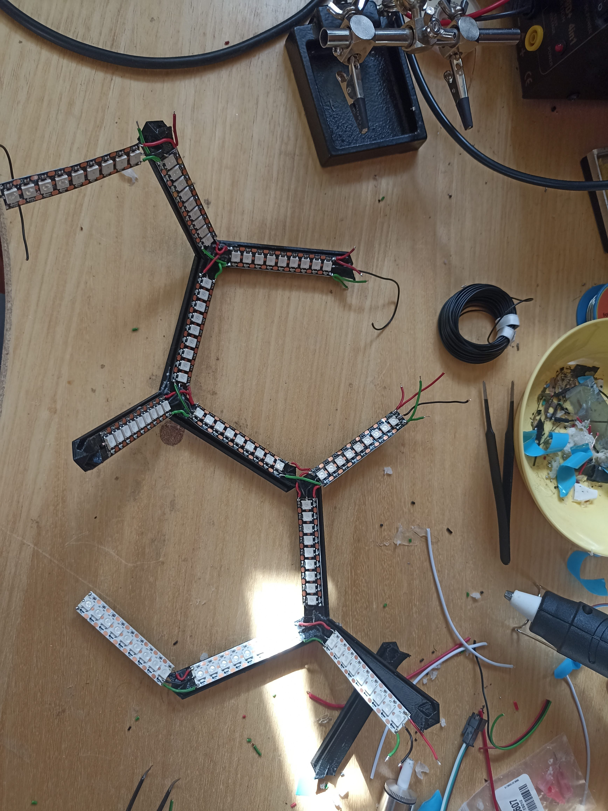
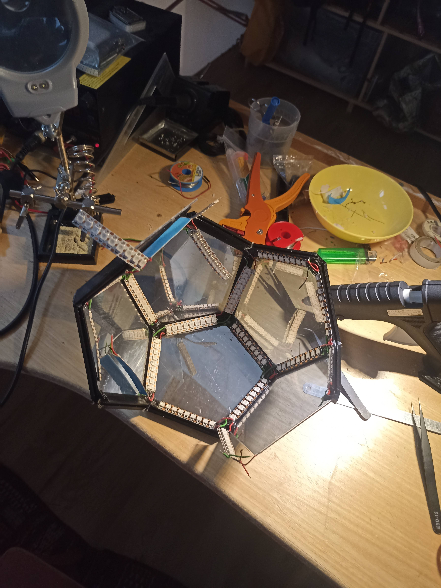

# led-dodecahedron
A 3D-printed "infinity lights" dodecahedron

When starting to tinker with LED strips and aiming to embark on a first project with tangible applications, the dodecahedron proves to be an excellent choice for achieving very pleasant results. While the task may not be inherently straightforward and requires a lot of planning and precision, fortunately, there is a plethora of examples and tutorials available for crafting your own "infinity dodecahedron".
This project was largely based on ([this instructable](https://www.instructables.com/Infinity-Dodecahedron-Mirror/)), which I strongely recommend if you intend to make your own.
However, in my case, I opted for a different edge model as I aimed to create a smaller dodecahedron (8cm/edge), necessitating thinner and more discreet edges. I relied on a modified version of ([these ones](https://www.printables.com/fr/model/41457-diy-infinity-dodecahedron/comments)), shortening them accordingly using Blender. Additionally, I widened the slots intended for inserting the plexiglass panes (which were 2mm thick) and created three variations to accommodate data cables.

## Applying one way mirror film

Contrary to my initial assumption, no adhesive is required for attaching the film to the plexiglass. Simply wetting the film with soapy water, pressing it against the glass, and allowing it to dry is sufficient. However, the challenge lies in preventing dust from getting trapped beneath the film. Wetting the plexiglass beforehand can help. Be cautious as the glass scratches easily. I experimented with various methods to press the film against the glass (different credit cards, plastic squeegees), but I couldn't find one that leaves no marks on the glass.

## Soldering and gluing

This is where the biggest challenge of the project lies: assembling the dodecahedron requires soldering and gluing the elements together progressively. It's crucial to meticulously plan the data line flow through a diagram and anticipate where the 12 edges with inserts will be to allow the data cable to turn around. 
Gluing the edges should be done in groups of three to avoid gaps at the junctions and to strengthen the structure. However, at certain points, it's necessary to connect different parts of the dodecahedron together and leave spaces for additional edges. Additionally, due to the high density and short length of the edges used, I had to cut the LED strips, leaving minimal space for soldering. Some pads were either damaged or too small, so I sometimes had to solder the cables directly onto the WS2812 pads instead of the PCB. One way to simplify this task would be to ensure the edge length corresponds to the distribution of the LEDs on the strip to have wider pads at the ends each time, but this may waste some LEDs each time (unless making a large dodecahedron). 
Another challenge is inserting the panes into the slots of the edges, which requires careful planning to ensure there are always at least two free edges to insert the pane (generally, whenever possible, it's preferable to glue the panes simultaneously with the edges).

## Controller

To animate and control my LEDs, I used an ESP-32 and ([the very comprehensive WLED system](https://kno.wled.ge/)), which offers multiple ways to interface the LEDs with various software (web app via WiFi, Artnet connection to software like Resolume, DMX connection, etc.). An extension of WLED (Moon-Module) also allows connecting an audio input for sound-reactive or music-responsive lighting effects, making it relatively autonomous. In my case, I used an INMP-441 microphone. It's a digital microphone with an I2S output, avoiding many complications associated with analog signals and potential interference. Since the ESP-32 has a 5V input, all I needed to do was connect everything to a PCB and a USB-C connector.

